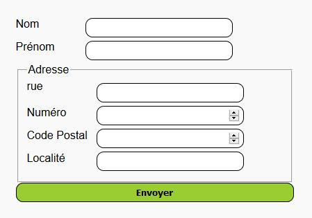

# Final 
## Exercice 1 - Pseudo-classes

:::Tableau
```html
<table>
	<tr>
		<td>Ligne 1 - Colonne 1</td>
		<td>Ligne 1 - Colonne 2</td>
		<td>Ligne 1 - Colonne 3</td>
	</tr>
	<tr>
		<td>Ligne 2 - Colonne 1</td>
		<td>Ligne 2 - Colonne 2</td>
		<td>Ligne 2 - Colonne 3</td>
	</tr>
	<tr>
		<td>Ligne 3 - Colonne 1</td>
		<td>Ligne 3 - Colonne 2</td>
		<td>Ligne 3 - Colonne 3</td>
	</tr>
	<tr>
		<td>Ligne 4 - Colonne 1</td>
		<td>Ligne 4 - Colonne 2</td>
		<td>Ligne 4 - Colonne 3</td>
	</tr>
	<tr>
		<td>Ligne 5 - Colonne 1</td>
		<td>Ligne 5 - Colonne 2</td>
		<td>Ligne 5 - Colonne 3</td>
	</tr>
	<tr>
		<td>Ligne 6 - Colonne 1</td>
		<td>Ligne 6 - Colonne 2</td>
		<td>Ligne 6 - Colonne 3</td>
	</tr>
	<tr>
		<td>Ligne 7 - Colonne 1</td>
		<td>Ligne 7 - Colonne 2</td>
		<td>Ligne 7 - Colonne 3</td>
	</tr>
	<tr>
		<td>Ligne 8 - Colonne 1</td>
		<td>Ligne 8 - Colonne 2</td>
		<td>Ligne 8 - Colonne 3</td>
	</tr>
	<tr>
		<td>Ligne 9 - Colonne 1</td>
		<td>Ligne 9 - Colonne 2</td>
		<td>Ligne 9 - Colonne 3</td>
	</tr>
</table>
```
:::

Pour cet exercice, il faut : 
- mettre une bordure et une marge interne sur chaque case du tableau.
- colorier le fond des lignes impaires du tableau.
- colorier le texte de la dernière ligne du tableau.

@[Exercice 1]({"stubs": ["css/style.css"], "command": "/bin/bash run.sh table.html css/style.css css/table.css"})

## Exercice 2 - Formulaire et positionnement	

::: Formulaire
```html
<form action="" method="post">
	<label for="nom">Nom</label>
	<input type="text" name="nom" id="nom" required>
	<label for="prenom">Prénom</label>
	<input type="text" name="prenom" id="prenom" required>
	<fieldset>
		<legend>Adresse</legend>
		<label for="rue">rue</label>
		<input type="text" name="rue" id="rue">
		<label for="num">Numéro</label>
		<input type="number" name="num" id="num">
		<label for="cp">Code Postal</label>
		<input type="number" name="cp" id="cp">
		<label for="loc">Localité</label>
		<input type="text" name="loc" id="loc">
	</fieldset>
	<input type="submit" value="Envoyer">
</form>
```
:::

Pour cet exercice :
- Les textes du formulaire sont en Helvetica, la largeur globale du formulaire est de 400px, il doit être centré dans la page et écarté du bord supérieur de la page de 100px.
- Des input avec une bordure noire continue de 1 pixel, des bords arrondis, une largeur fixée à 200px et faire en sorte que les champs soient espacés les uns des autres. Attention à ne pas commencer la frappe dans l'arrondi du champ.
- Des label de 100px de large à gauche des champs de saisie.
- Le bouton d'envoi doit avoir une couleur de fond modifiée, faire 400px de large et l'écriture doit être en gras au centre du bouton.
- L'input ayant le focus doit avoir un bord de 2px bleu.

:::Résultat attendu

:::

:::Propriétés utiles
- Toutes celles déjà rencontrées
- [`display`](https://www.w3schools.com/cssref/pr_class_display.asp) 
- [`float`](https://www.w3schools.com/cssref/pr_class_float.asp) 
- [`border-radius`](https://www.w3schools.com/cssref/css3_pr_border-radius.asp)
- [`margin` auto](https://www.w3schools.com/css/css_margin.asp)
- Informations complémentaire sur les [`form` et le CSS](https://www.w3schools.com/css/css_form.asp)
:::

@[Exerice 2]({"stubs": ["css/style.css"], "command": "/bin/bash run.sh form.html css/style.css css/form.css"})
